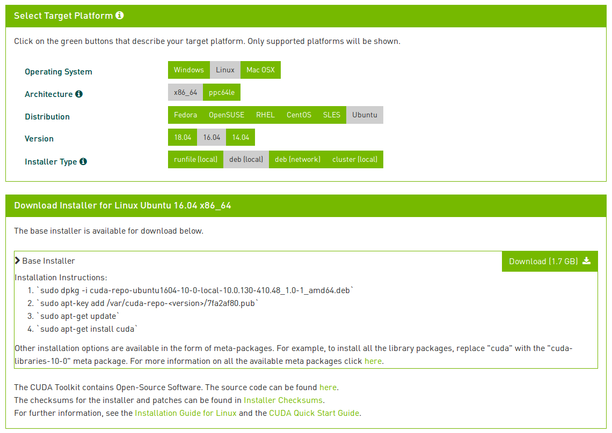

### 1. Update NVIDIA Driver (on Xubuntu)
```
# check NVIDIA Driver version 
cat /proc/driver/nvidia/version
```

Go to "All Settings > Additional Drivers" and you should see a list of all available nvidia drivers ready to be installed. Select the correct driver and click Apply Changes. The new driver would be downloaded, installed and configured for use. Restart to ensure the driver takes effect.


### 2. Install [CUDA](https://developer.nvidia.com/cuda-downloads)


- Operating System: Linux
- Architecture: x86_64
- Distribution: Ubuntu
- Version: 16.04
- Installer Type: deb (local)

```
# remove old CUDA
sudo apt-get --purge remove cuda

# install new CUDA
sudo dpkg -i cuda-repo-ubuntu1604-10-0-local-10.0.130-410.48_1.0-1_amd64
sudo apt-key add /var/cuda-repo-10-0-local-10.0.130-410.48/7fa2af80.pub 
sudo apt-get update
sudo apt-get install cuda

# add CUDA path to PATH variable
# export PATH=/usr/local/cuda/bin:$PATH

# test
cuda-install-samples-10.0.sh $PWD
cd NVIDIA_CUDA-10.0_Samples/
make
cd bin/x86_64/linux/release
./deviceQuery
./bandwidthTest
```

### 3 Install [cuDNN](https://developer.nvidia.com/rdp/cudnn-download)
```
sudo dpkg -i libcudnn7_7.3.1.20-1+cuda10.0_amd64.deb
sudo dpkg -i libcudnn7-dev_7.3.1.20-1+cuda10.0_amd64.deb
sudo dpkg -i libcudnn7-doc_7.3.1.20-1+cuda10.0_amd64.deb

# test 
cp -r /usr/src/cudnn_samples_v7/ $PWD
cd  $PWD/cudnn_samples_v7/mnistCUDNN
make clean && make
./mnistCUDNN
```
[To fix mnist example compile-error](
https://devtalk.nvidia.com/default/topic/1006726/gpu-accelerated-libraries/cudnnv6-mnist-example-compile-errors/post/5141355/):
```
Open the file:
/usr/include/cudnn.h

And try change the line:
#include "driver_types.h"

to:
#include <driver_types.h> 
```

### 4. Tips
##### 1. Check [CUDA-Enabled GeForce Products](https://developer.nvidia.com/cuda-gpus)
- GPU: GeForce GTX1080 Ti
- Compute Capability: 6.1
##### 2. Check Ubuntu version:
```
lsb_release -a
```
##### 3. Download Document
```
wget https://docs.nvidia.com/cuda/pdf/CUDA_Installation_Guide_Linux.pdf
wget https://docs.nvidia.com/deeplearning/sdk/pdf/cuDNN-Installation-Guide.pdf
```


